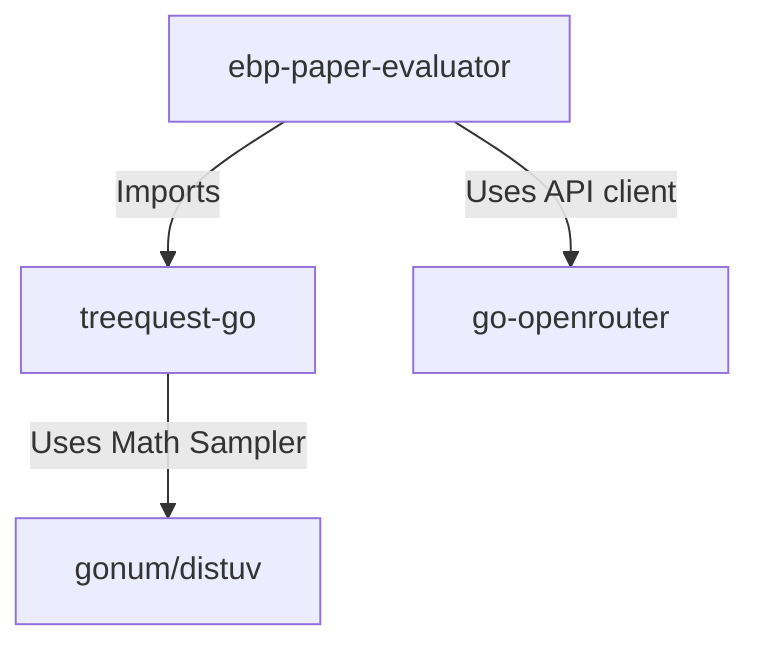

# Implementation Plan: TreeQuest Go Port and EBP Paper Evaluator (Final)

This document outlines the design and implementation specifications for porting Sakana AI's `treequest` library (AB-MCTS) to Go, and building the downstream `ebp-paper-evaluator` application using OpenRouter.

---

## User Review Required

> [!IMPORTANT]
> The target library `treequest-go` is built to be strictly general-purpose and generic (`[S any]`). It has **zero** dependencies on LLMs, OpenRouter, prompt templates, EBP, or any domain concepts. All LLM and evaluation workflows reside in `ebp-paper-evaluator`.

> [!IMPORTANT]
> Version 0.1 prioritizes the **AB-MCTS-A** algorithm (Thompson Sampling with Beta distributions). The **AB-MCTS-M** algorithm is deferred to a future spike because it depends on heavy Bayesian MCMC packages (like PyMC/NumPyro) that do not have pure-Go equivalents.

---

## Open Questions

> [!NOTE]
> Currently, no external questions are open. The boundaries between the generic MCTS engine and the downstream OpenRouter adapter are clearly defined.

---

## Proposed Changes

### Component 1: `treequest-go` (Generic Search Library)

A new, independent Go module designed for generic adaptive tree search.

#### [NEW] [node.go](file:///home/chaschel/Documents/go/treequest/pkg/tree/node.go)
Defines neutral core type sets (`ActionLabel`, `NodeID`, `TrialID`, `Score`), the generic `Node[S any]`, and runtime bandit data structures.

#### [NEW] [tree.go](file:///home/chaschel/Documents/go/treequest/pkg/tree/tree.go)
Defines the generic `SearchTree[S any]` and concurrency control mechanisms.

#### [NEW] [checkpoint.go](file:///home/chaschel/Documents/go/treequest/pkg/tree/checkpoint.go)
Defines the flat `NodeRecord` structure and `StateCodec[S any]` for snapshot serialization.

#### [NEW] [bandit.go](file:///home/chaschel/Documents/go/treequest/pkg/algo/bandit.go)
Implements Beta Thompson Sampling using `gonum/distuv`.

#### [NEW] [abmcts_a.go](file:///home/chaschel/Documents/go/treequest/pkg/algo/abmcts_a.go)
Implements the core AB-MCTS-A action selection, expansion, and backpropagation mechanics.

#### [NEW] [types.go](file:///home/chaschel/Documents/go/treequest/pkg/algo/types.go)
Defines interfaces like `Algorithm[S, AS]` (with full `context.Context` support) and function signatures like `GenerateFn[S]`.

---

### Component 2: `ebp-paper-evaluator` (Downstream Application)

A separate application using `treequest-go` to run constructive (A), adversarial (B), and evaluator (E) roles via OpenRouter.

#### [NEW] [state.go](file:///home/chaschel/Documents/go/treequest/ebp-paper-evaluator/pkg/ebp/state.go)
Defines EBP-specific states (`ClaimEvalState`) including debt tracking and Workbench2 parameters.

#### [NEW] [client.go](file:///home/chaschel/Documents/go/treequest/ebp-paper-evaluator/pkg/llm/client.go)
Defines LLM provider abstractions and the OpenRouter client adapter backed by `github.com/revrost/go-openrouter`.

#### [NEW] [worker_a.go](file:///home/chaschel/Documents/go/treequest/ebp-paper-evaluator/pkg/ebp/worker_a.go)
Constructive worker generating refinements.

#### [NEW] [worker_b.go](file:///home/chaschel/Documents/go/treequest/ebp-paper-evaluator/pkg/ebp/worker_b.go)
Adversarial worker critique generator.

#### [NEW] [evaluator.go](file:///home/chaschel/Documents/go/treequest/ebp-paper-evaluator/pkg/ebp/evaluator.go)
Evaluator E prompt and scoring module.

#### [NEW] [main.go](file:///home/chaschel/Documents/go/treequest/ebp-paper-evaluator/cmd/evaluate/main.go)
CLI interface.

---

## Detailed 22-Section Design Document

### 1. Executive Summary
The target is a high-fidelity port of Sakana AI's `treequest` to Go. The project is split into:
1. **`treequest-go`**: A general-purpose library implementing AB-MCTS-A using Go generics, context, and Beta sampling (via Gonum).
2. **`ebp-paper-evaluator`**: A domain-specific evaluator application that runs constructive, adversarial, and evaluator roles. It implements EBP 2.1 / Workbench2 logic and relies on `go-openrouter` for API integration.

### 2. Final Architecture: Two Repositories
The codebase is strictly separated to enforce clean generic boundaries:
* **`treequest-go`**: Pure algorithm. Generics `S any` allow the library to handle any search task. It is completely decoupled from LLMs.
* **`ebp-paper-evaluator`**: Downstream consumer. Defines prompt templates, EBP claim state structures, and LLM call patterns.



### 3. `treequest-go` Package Layout
```text
treequest-go/
├── go.mod
├── pkg/
│   ├── tree/
│   │   ├── node.go          # Node[S] & BetaParams
│   │   ├── tree.go          # SearchTree[S] + sync primitives
│   │   └── checkpoint.go    # JSON snapshot struct, StateCodec[S]
│   └── algo/
│       ├── abmcts_a.go      # AB-MCTS-A algorithm
│       ├── bandit.go        # Beta distribution sampler (Gonum wrapper)
│       └── types.go         # Algorithm[S, AS], GenerateFn[S]
└── test/
    └── parity_test.go       # Trace-based replay tests
```

### 4. `treequest-go` Public API Design
The public API relies on the **Ask / Tell** pattern to support stateless operation:
* **`Algorithm[S, AS]`**: Represents the stateless search algorithm.
* **`AskBatch` / `Ask`**: Fetches the next target nodes and action identifiers to expand.
* **`Tell`**: Updates the search tree with a generated result. It is idempotent and order-independent.
* **`Step`**: A convenience wrapper executing an inline, blocking expansion for synchronous runs.

### 5. Core Type Definitions with Go Code Sketches
```go
package tree

import (
    "sync"
)

type ActionLabel string
type NodeID string
type TrialID string
type Score float64

type BetaParams struct {
    Alpha float64 `json:"alpha"`
    Beta  float64 `json:"beta"`
}

type Node[S any] struct {
    ID                NodeID
    ParentID          *NodeID
    ChildrenIDs       []NodeID
    State             S
    Score             Score
    Depth             int
    ExpandIdx         int
    WiderBandit       BetaParams
    DeeperBandit      BetaParams
    ActionBandits     map[ActionLabel]BetaParams
    GeneratedByAction ActionLabel
    
    // Non-serialized pointers
    Parent            *Node[S]
    Children          []*Node[S]
    mu                sync.Mutex
}

type SearchTree[S any] struct {
    Root     *Node[S]
    AllNodes map[NodeID]*Node[S]
    mu       sync.RWMutex
}
```

```go
package algo

import (
    "context"
    tree "treequest-go/pkg/tree"
)

type TrialStatus string
const (
    TrialPending   TrialStatus = "pending"
    TrialCompleted TrialStatus = "completed"
    TrialFailed    TrialStatus = "failed"
    TrialCanceled  TrialStatus = "canceled"
)

type Trial[S any] struct {
    TrialID      tree.TrialID     `json:"trial_id"`
    NodeToExpand tree.NodeID      `json:"node_to_expand"`
    Action       tree.ActionLabel `json:"action"`
    Result       *StateScore[S]   `json:"result,omitempty"`
    ParentState  *S               `json:"parent_state,omitempty"`
    Status       TrialStatus      `json:"status"`
}

type TrialStore[S any] struct {
    Pending  map[tree.TrialID]Trial[S] `json:"pending"`
    Finished map[tree.TrialID]Trial[S] `json:"finished"`
}

type Reward struct {
    Score         tree.Score         `json:"score"`
    Components    map[string]float64 `json:"components,omitempty"`
    Justification string             `json:"justification,omitempty"`
    Meta          map[string]any     `json:"meta,omitempty"`
}

type StateScore[S any] struct {
    State      S      `json:"state"`
    Reward     Reward `json:"reward"`
    ResultHash string `json:"result_hash"`
}

type Algorithm[S any, AS any] interface {
    InitTree(ctx context.Context) (AS, error)

    AskBatch(
        ctx context.Context,
        state AS,
        batchSize int,
        actions []tree.ActionLabel,
    ) (AS, []Trial[S], error)

    Ask(
        ctx context.Context,
        state AS,
        actions []tree.ActionLabel,
    ) (AS, Trial[S], error)

    Tell(
        ctx context.Context,
        state AS,
        trialID tree.TrialID,
        result StateScore[S],
    ) (AS, error)

    StateScorePairs(state AS) []StateScore[S]
}
```

### 6. AB-MCTS-A Algorithm Implementation Plan
The algorithm alternates direction (wider vs deeper) and action selection using Beta Thompson sampling:
1. **Selection (Wider vs Deeper):** Walk down the tree starting at `Root`. At each node, draw $s_w \sim \text{Beta}(\alpha_w, \beta_w)$ and $s_d \sim \text{Beta}(\alpha_d, \beta_d)$. If $s_w > s_d$, or the node is a leaf, stop and designate this node as the expansion target. Otherwise, choose the child with the highest mean reward $\frac{\alpha}{\alpha + \beta}$ and descend.
2. **Action Selection:** At the target node, draw a sample $s_a \sim \text{Beta}(\alpha_a, \beta_a)$ for each available action. The action with the highest drawn sample wins.
3. **Backpropagation:** Once `Tell` provides a score $s \in [0, 1]$, walk back up from the target node to the root. For the node where the decision was "wider", update:
   $$\alpha_w \leftarrow \alpha_w + s, \quad \beta_w \leftarrow \beta_w + (1 - s)$$
   and update the chosen action's parameters. For intermediate ancestor nodes where the selection chose to descend, update:
   $$\alpha_d \leftarrow \alpha_d + s, \quad \beta_d \leftarrow \beta_d + (1 - s)$$

### 7. TrialStore and Idempotent `Tell` Design
`Tell` must be robust against API failures and duplicate calls:
* When `AskBatch` / `Ask` is called, new trials are registered as `TrialPending` with a unique `TrialID`.
* On calling `Tell(ctx, state, trialID, result)`:
  * If `trialID` is not found, return an `ErrUnknownTrial`.
  * If the trial exists as `TrialCompleted`:
    * If the incoming `ResultHash` matches the recorded result hash (or is derived through `StateCodec[S]`), treat it as a no-op (idempotency).
    * If the result differs, return `ErrResultMismatch`.
  * If the trial exists as `TrialPending`:
    * Transition to `TrialCompleted`.
    * Mutate the tree (add child node) and trigger backpropagation.
  * If the trial failed or was canceled, transition appropriately.

### 8. Score Validation and Reward Metadata Plan
* **Core Limit:** The search core accepts only scalar values strictly bounded within $[0, 1]$.
* **Validation:** Any score outside this range (or `NaN`, `+Inf`, `-Inf`) will trigger a validation error and fail the `Tell` transaction.
* **Separation of Concerns:** Contextual data (rubrics, components, rationale) must be stored inside the `Reward` structure or the generic state `S`. The core math uses only `Reward.Score`.
* **ResultHash Derivation:** If `ResultHash` is empty, the core derives it using the configured `StateCodec[S]` plus normalized score. If the application supplies `ResultHash`, the core verifies duplicate `Tell` calls against that hash. This prevents every caller from having to implement hashing manually.

### 9. Randomness/Reproducibility Plan
* To achieve reproducibility, the math functions sample from an injected source of randomness.
* Define a `Sampler` interface:
  ```go
  type Sampler interface {
      SampleBeta(alpha, beta float64) float64
  }
  ```
* Implement `GonumSampler` wrapping `gonum/distuv` with a seeded `math/rand.Rand` source.
* In tests, mock the sampler to return hard-coded arrays of floats, creating 100% deterministic search decisions.

### 10. Snapshot/Restore and `StateCodec[S]` Plan
Since `S` is generic, standard JSON unmarshalling cannot recover concrete structures directly. We define:
```go
type StateCodec[S any] interface {
    MarshalState(state S) ([]byte, error)
    UnmarshalState(data []byte) (S, error)
}
```
* **Pointer-Free Snapshots:** Flat node records are serialized to keep the snapshot simple:
```go
type NodeRecord struct {
    ID                tree.NodeID                 `json:"id"`
    ParentID          *tree.NodeID                `json:"parent_id,omitempty"`
    ChildrenIDs       []tree.NodeID               `json:"children_ids,omitempty"`
    EncodedState      []byte                      `json:"encoded_state"`
    Score             tree.Score                  `json:"score"`
    Depth             int                         `json:"depth"`
    ExpandIdx         int                         `json:"expand_idx"`
    WiderBandit       tree.BetaParams             `json:"wider_bandit"`
    DeeperBandit      tree.BetaParams             `json:"deeper_bandit"`
    ActionBandits     map[tree.ActionLabel]tree.BetaParams `json:"action_bandits"`
    GeneratedByAction tree.ActionLabel            `json:"generated_by_action"`
}
```

### 11. v0.1 Milestone Breakdown with Tests
* **Milestone 1 (Bandits & Primitives):** Implementation of `BetaSampler`. Tests: verify sampling distribution limits and reproducibility.
* **Milestone 2 (Search Tree Structure):** Implementation of `Node[S]`, `SearchTree[S]`, and `TrialStore`. Tests: verify basic node insertion and tree properties.
* **Milestone 3 (AB-MCTS-A Engine):** Implementation of `AskBatch`/`Ask` and idempotent `Tell` updates. Tests: mock a simple binary choice problem and ensure search converges to the higher reward.
* **Milestone 4 (Checkpoints & Snapshots):** Testing `StateCodec` with JSON serializers.

### 12. v0.2+ Roadmap
* Implement standard MCTS and Multi-Armed Bandit UCB.
* Support Graphviz/DOT serialization of checkpoints.
* Add Gaussian prior options to bandit strategies.
* Explore a research spike on porting `AB-MCTS-M` (Gaussian mixed models).

### 13. Python Parity/Replay Test Strategy
We will extract fixed execution traces from Sakana's Python library:
1. Define a list of actions and deterministic scores.
2. Output a step-by-step trace: `(SelectionPath, SelectedAction, ScoreReturned)`.
3. In Go, using the mock sampler, execute the search loop with the same decisions. Verify that the tree nodes, selection paths, and bandit parameters align exactly with the Python output.
> [!NOTE]
> Exact wider/deeper/action bandit update rules must be confirmed against upstream TreeQuest traces before claiming source-faithful parity.

### 14. `ebp-paper-evaluator` Package Layout
```text
ebp-paper-evaluator/
├── go.mod
├── cmd/
│   └── evaluate/
│       └── main.go          # CLI entry point
└── pkg/
    ├── ebp/
    │   ├── state.go         # ClaimEvalState
    │   ├── worker_a.go      # Worker A logic
    │   ├── worker_b.go      # Worker B logic
    │   └── evaluator.go     # Evaluator E prompt + score parser
    └── llm/
        ├── client.go        # LLMClient interface & OpenRouter adapter
        └── mock.go          # Fake LLM client for tests
```

### 15. EBP Worker A / Worker B / Evaluator E Flow
* **State Struct:**
  ```go
  type ClaimEvalState struct {
      ClaimText            string   `json:"claim_text"`
      ConstructiveAnalysis string   `json:"constructive_analysis"`
      AdversarialReview    string   `json:"adversarial_review"`
      RemainingDebt        []string `json:"remaining_debt"`
      RetiredDebt          []string `json:"retired_debt"`
      FinalTruthFlag       bool     `json:"final_truth_flag"`
      BudgetExhausted      bool     `json:"budget_exhausted"`
  }
  ```
* **Step Cycle & Complete State Invariant:**
  * Worker A updates `ConstructiveAnalysis`. Calls Evaluator E to score it.
  * Worker B reads the constructive analysis, updates `AdversarialReview`, and checks for Workbench flags. Calls Evaluator E to score it.
  * Evaluator E returns a structured JSON payload:
    ```json
    {
      "score": 0.85,
      "remaining_debt": ["needToyCheck"],
      "final_truth_language_detected": false
    }
    ```
  * > [!IMPORTANT]
    > **Complete State Invariant:** Both actions must return a complete `ClaimEvalState`. A patch-only critique or partial worker output must be applied to the parent state before evaluator E scores the candidate and before TreeQuest receives `Tell`.

### 16. Deterministic EBP Validators
LLMs can be inconsistent. The Go application will layer deterministic validators on top of the LLM responses:
* **Citation Verification:** Checks if sources in the analysis match indices in the original paper.
* **Final-Truth Check:** Regex search for blocked assertions (e.g. `this proves`, `is final reality`).
* **Debt Consistency:** Verify that retired debt list matches the presence of required structures (like a map declaration).

### 17. Budget and Provenance Model
* **Hard Caps:** `MaxLLMCalls` and `MaxTokensPerCall` can be set as hard boundaries.
* **Turn Limits:** Define a `MaxTurns` parameter representing the maximum depth of critique. If a branch reaches this depth without resolving all debt, it sets `BudgetExhausted: true`.
* **Provenance Log:** Records model IDs, prompt hashes, temperature, actual tokens, cost, and timestamps.

### 18. Output Artifact Bundle Design
Runs generate an immutable bundle directory:
```text
out/audit/
├── original_paper.pdf       # Source
├── assessment_report.md     # Workbench2 core report
├── claim_ledger.json        # Detailed claims & debt tracking
├── provenance.json          # API keys masked, model hashes, cost logs
├── budget_usage.json        # Explicit budget consumption report
└── tree_snapshot.json       # Serialized SearchTree
```

### 19. Risks and Mitigations
* **Risk: Beta distribution sampling drift.** Mitigation: Use trace-based test fixtures.
* **Risk: OpenRouter API timeouts.** Mitigation: Implement exponential backoff retry wrappers on the `LLMClient` adapter.
* **Risk: State space explosion.** Mitigation: Set low default `MaxIterations` (< 50) and limit search tree depth.

### 20. Explicit Non-Goals
* v0.1 will not feature a graphical web UI.
* v0.1 will not run Python bindings or PyMC.
* `treequest-go` will not use or import any network package.

### 21. Acceptance Criteria for v0.1
* `go test ./...` passes with 100% determinism.
* The application can execute a complete mock run without hitches.
* > [!NOTE]
  > Parity fixtures verify identical decisions on controlled deterministic traces where sampler outputs, actions, and scores are fixed; broader source-faithfulness remains pending review.

### 22. EBP/PTW Self-Audit
We audit this plan against our EBP v2.1 checklist:
* **`needMap`**: Completed map details domain and codomain boundaries.
* **`needInvariant`**: Explicitly tracks what remains invariant during MCTS selection.
* **`needToyCheck`**: Trace-replay checks serve as the toy verification model.
* **`needNullModel`**: Simplest flat MCTS is the null model. Standard MCTS / Best-First / BFS are planned in v0.2 as baseline null models.
* **`needObstruction`**: Main obstructions are source-faithfulness uncertainty, idempotency hashing ambiguity, snapshot codec complexity, and OpenRouter adapter instability.
* **`needFaithfulnessReview`**: Required before claiming parity with Sakana TreeQuest.
* **Promotion Status**: `implementation_plan_accepted_for_implementation`; not yet code-accepted or source-faithful until tests and parity fixtures pass.

---

## OpenRouter Adapter Isolation Boundary
> [!NOTE]
> OpenRouter adapter is replaceable. If the unofficial client (`github.com/revrost/go-openrouter`) changes or the official OpenRouter Go SDK (`github.com/OpenRouterTeam/go-sdk`) becomes preferable, only the app-layer adapter changes.

---

## Verification Plan

### Automated Tests
* Run unit tests for distribution sampler:
  ```bash
  go test -v ./pkg/algo/...
  ```
* Run integration tests for the mock evaluator:
  ```bash
  go test -v ./pkg/tree/...
  ```

### Manual Verification
* Inspect the mock trace outputs to verify they are deterministic.
* Confirm that the directory structures match the planned architecture.

# Task List: TreeQuest Go Port and EBP Paper Evaluator

- `[/]` Core `treequest-go` Library Implementation
    - `[ ]` Initialize Go module for `treequest-go`
    - `[ ]` Implement core types: Node, Score, ActionLabel, Trial, TrialStore (`pkg/tree/node.go`, `pkg/algo/types.go`)
    - `[ ]` Implement Beta Thompson Sampler using `gonum/distuv` (`pkg/algo/bandit.go`)
    - `[ ]` Implement SearchTree and concurrent state mappings (`pkg/tree/tree.go`)
    - `[ ]` Implement AB-MCTS-A Search Engine (`pkg/algo/abmcts_a.go`)
        - `[ ]` Implement selection logic (wider vs deeper)
        - `[ ]` Implement action selection logic
        - `[ ]` Implement backpropagation logic
    - `[ ]` Implement idempotent `Tell` with `ResultHash` checking
    - `[ ]` Implement pointer-free Snapshot/Restore with `StateCodec[S]` (`pkg/tree/checkpoint.go`)
    - `[ ]` Add comprehensive unit tests and deterministic toy test suites

- `[ ]` `ebp-paper-evaluator` Downstream Application
    - `[ ]` Initialize Go module for `ebp-paper-evaluator` importing `treequest-go`
    - `[ ]` Implement OpenRouter Client and Mock Adapters (`pkg/llm/client.go`)
    - `[ ]` Implement constructive (A) and adversarial (B) worker flows
    - `[ ]` Implement evaluator E scoring, rubric mapping, and JSON response parsing
    - `[ ]` Implement deterministic EBP validators (citation, final-truth, debt alignment)
    - `[ ]` Implement multi-layer budget limits and token/cost provenance logs
    - `[ ]` Implement output artifact bundle generator (reports, ledgers, snapshot JSON)
    - `[ ]` Create CLI running command (`ebp-paper-evaluator run`)
    - `[ ]` Run end-to-end dry-run and integration validation
